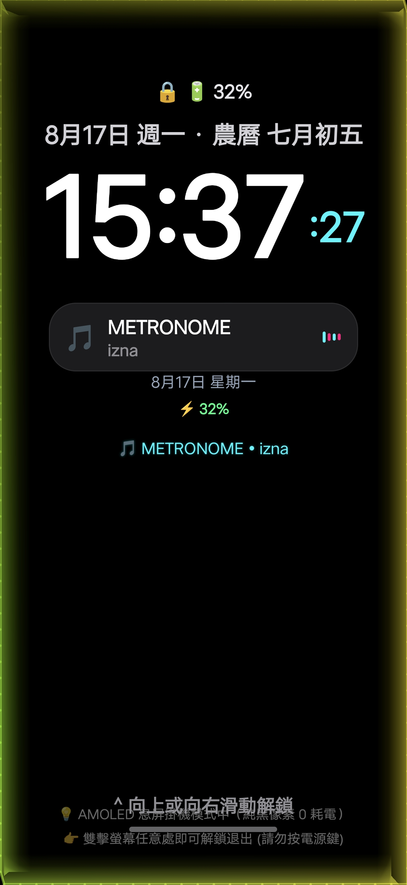
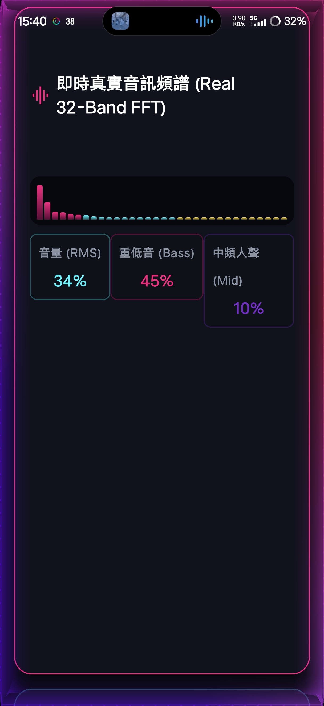
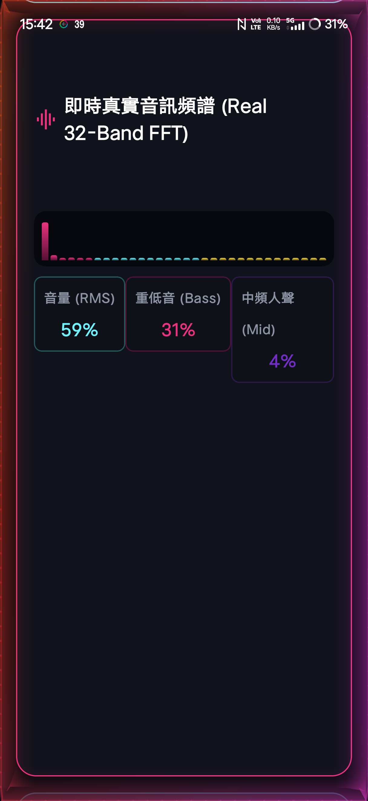

# 🌌 視覺動態效果 (Visual Dynamic Effects)

<div align="center">


-success?style=for-the-badge&logo=android)


**為追求極致音樂氛圍打造的跨平台音效視覺化系統**  
*The Ultimate Cross-Platform Audio Visualization & Ambient Lighting Ecosystem for Android & Windows.*

[📥 快速下載安裝包 (Releases)](#-快速下載與安裝-download--install) • [📱 Android 手機端介紹](#-android-手機端特色) • [💻 Windows Rainmeter 介紹](#-windows-電腦端特色-rainmeter) • [🖼️ 實機展示](#️-實機效果展示-showcase) • [English Version](#-english-overview)

</div>

---

## 🌟 項目簡介 (Project Overview)

**Audio Ambient Glow Suite** 是一套融合了 **高精度傅立葉頻譜分析 (FFT)** 與 **非線性重低音爆衝物理引擎** 的全方位音樂氛圍視覺化系統。本項目同時提供：
1. **Android 手機端 App (`手機音效氣氛燈.apk`)**：全時懸浮音樂邊框、息屏 AOD 音響卡片模式、黑膠唱片律動、免麥克風零衝突系統音訊感知。
2. **Windows 電腦端套件 (`MusicAudioGlow_Suite_v2.0.rmskin`)**：144Hz 極限刷新率、360° 全螢幕邊框環繞流光、內建 5 種燈光風格切換、工作列動態音樂小工具。

---

## 📱 Part 1: Android 手機端氣氛燈特色

* **純系統媒體音訊感知 (免麥克風)**：
  * 直接捕捉系統音訊回傳信號，不調用麥克風硬體。
  * **零隱私指示燈干擾**（不會出現黃綠色錄音點），語音通話與打電話時 100% 零衝突、不中斷。
* **息屏 AOD 音響卡片模式 (擬真黑膠 + 播放控制)**：
  * 支援 **直向 (Portrait)** 與 **橫向音響模式 (Landscape Speaker Mode)** 自動旋轉適配。
  * **滿版黑膠唱片** 隨歌曲旋轉與低音震顫脈動。
  * 內建 **播放 / 暫停、上一首、下一首** 觸控播放控制器。
  * 傳統干支農曆曆法時鐘（歲次干支、圓潤字體）與高穿透度幽暗質感介面，夜間不刺眼。
* **非線性重低音爆衝加速引擎**：
  * 移植自電腦版物理模型，採用 **$(\text{Bass})^{1.8}$ 重低音指數爆衝曲線**。
  * 自適應手機 20:9 細長螢幕周長，慢歌優雅滑行、快歌電音瞬間爆衝狂飆！
* **AMOLED 極限省電與防烙印 (Anti-Burn-In)**：
  * AOD 背景採用純黑 RGB(0,0,0)，OLED 像素點完全斷電，每小時耗電量低於 1.5%~2.2%。
  * 內建 45 秒週期微震盪位移保護，杜絕螢幕烙印。
* **人耳黃金聽覺濾波 (50Hz ~ 2000Hz)**：
  * 精準捕捉 Kick 大鼓、Bassline 重低音與主唱中音，過濾極高頻雜訊。

---

## 💻 Part 2: Windows 電腦端 Rainmeter 特色 (音樂板 & 特效)

* **144Hz 滿血刷新率 (Update=7ms)**：
  * 完美支援高更新率電競螢幕與高畫質辦公顯示器，極致滑順零拖影。
* **WASAPI Direct 音訊迴路**：
  * 透過 Windows 底層音效 API 直接取樣，信號無衰減、反應時間小於 10ms。
* **360° 全螢幕四周邊框動態環繞流光 (`MusicAudioGlow`)**：
  * 四邊閉環首尾呼應，厚度方向純色均勻，內側柔和高斯模糊進階 Bloom。
  * 支援 **快開快關** 靈敏動態遮罩（~0.9s 漸入，暫停 ~1.1s 瞬間斷電熄滅）。
* **內建 5 大燈光風格自由切換**：
  * `1`: **全彩光譜閉環 (Rainbow 360°)** — 經典 360° 全彩流暢色盤。
  * `2`: **賽博龐克 (Cyberpunk)** — 霓虹粉紫 + 電光青。
  * `3`: **落日金光 (Sunset Gold)** — 熾熱金橙 + 魅惑洋紅。
  * `4`: **極光綠境 (Aurora)** — 翡翠碧綠 + 冰川冰藍。
  * `5`: **熔岩烈焰 (Lava Crimson)** — 烈焰赤紅 + 狂暴金黃。
* **工作列音樂律動小工具 (`BMediaTaskbarWidget`)**：
  * 整合工作列彩色波紋、文字震動與多媒體播放資訊。

---

## 📥 快速下載與安裝 (Download & Install)

### 📲 Android 手機端安裝
1. 前往 [`Release_Artifacts/`](Release_Artifacts/) 資料夾，下載 **[`手機音效氣氛燈.apk`](Release_Artifacts/手機音效氣氛燈.apk)**。
2. 傳輸至手機點擊安裝（支援 Android 8.0 ~ Android 15 各大品牌手機）。
3. 首次開啟時依引導授予「通知存取權限」與「懸浮視窗權限」即可開始享受！

### 🖥️ Windows 電腦端安裝
1. 先確保電腦已安裝 [Rainmeter 官方軟體](https://www.rainmeter.net/)（免費開源）。
2. 前往 [`Release_Artifacts/`](Release_Artifacts/) 下載 **[`MusicAudioGlow_Suite_v2.0.rmskin`](Release_Artifacts/MusicAudioGlow_Suite_v2.0.rmskin)**。
3. 雙擊執行 `.rmskin` 檔案並點擊 **Install** 即可一鍵載入所有流光與小工具！
4. 詳細設定與風格切換指南請參閱 [Rainmeter 安裝與配置教學](Rainmeter/Rainmeter_安裝與配置教學.md)。

---

## 🖼️ 實機效果展示 (Showcase)

| 📱 Android 設定與控制中心 | 🌙 息屏 AOD 直向音響模式 | 📻 息屏 AOD 橫向音響模式 |
| :---: | :---: | :---: |
|  |  |  |

---

## 📂 專案目錄結構 (Repository Structure)

```text
├── .gitignore
├── README.md                      # 項目繁體中文 & 英文說明手冊
├── Release_Artifacts/             # 官方最新發布可直接安裝之二進制檔案
│   ├── 手機音效氣氛燈.apk          # Android 完整編譯 APK (19.4 MB)
│   └── MusicAudioGlow_Suite_v2.0.rmskin  # Windows Rainmeter 一鍵安裝包 (143 KB)
├── Android/                       # Android 端 Kotlin 完整開源專案
│   ├── AudioAmbientGlow/          # 完整 Android Studio / Gradle 專案源碼
│   └── 手機音效氣氛燈_開發交接與規格書.md # Android 開發架構與技術交接文檔
├── Windows_Rainmeter/             # Windows 電腦端套件源碼與圖文手冊
│   ├── MusicAudioGlow/            # 360° 全螢幕邊框環繞流光 Skin 源碼
│   ├── BMediaTaskbarWidget/       # 工作列音樂資訊與律動小工具 Skin 源碼
│   ├── MusicAudioGlow_Suite_v2.0.rmskin  # 一鍵安裝包
│   └── Rainmeter_安裝與配置教學.md # 詳細圖文配置指引 (含 5 大風格切換教學)
└── Docs/                          # 截圖與技術說明展示
    └── Screenshots/               # 實機展示照片
```

---

## 🌐 English Overview

**Audio Ambient Glow Suite** is an advanced ambient music visualization system developed for Android and Windows PC.

* **Android Mobile Application**:
  * Pure system audio playback sensing (zero microphone requirement, zero privacy indicators, zero call interruptions).
  * Always-on Display (AOD) music mode with rotating vinyl record player, playback transport controls (Play/Pause/Skip), dynamic portrait/landscape auto-rotation, and AMOLED anti-burn-in protection.
  * Non-linear heavy bass acceleration curve $(\text{Bass}^{1.8})$ tailored for modern high-aspect-ratio mobile displays.
* **Windows PC Rainmeter Suite**:
  * 144Hz extreme refresh rate with WASAPI direct audio loopback.
  * 360° continuous border racetrack glow with 5 selectable mathematical color styles (`Rainbow`, `Cyberpunk`, `Sunset`, `Aurora`, `Lava`).
  * Dedicated Taskbar music visualizer widget.

---

## 📜 授權協議 (License)

This project is licensed under the **MIT License**.  
歡迎自由使用、學習交流、分享或提交 Pull Request！
